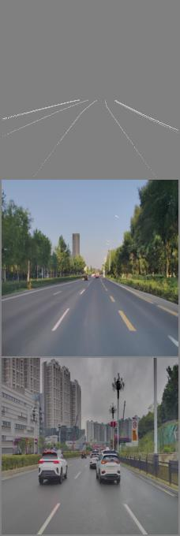
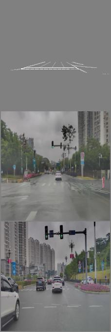
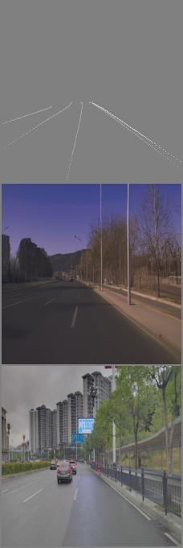
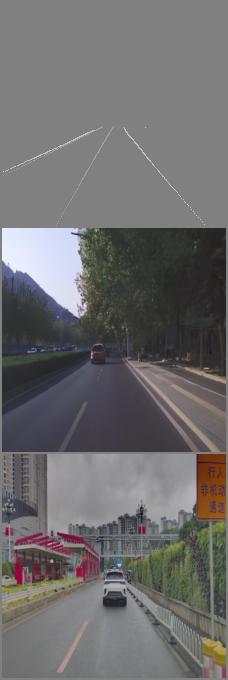
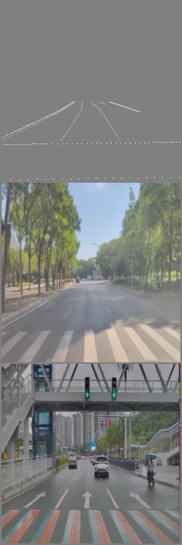
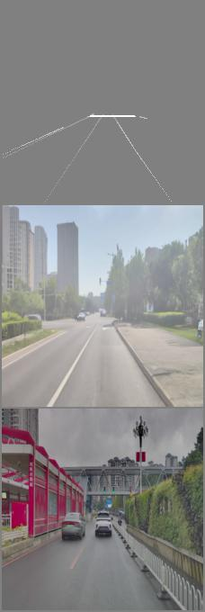
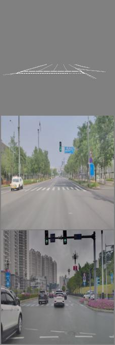
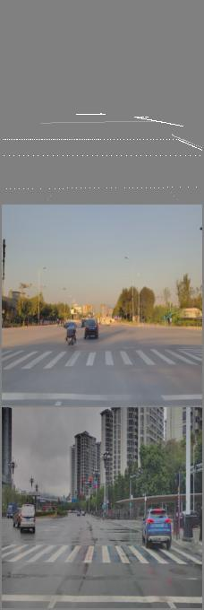

# driving-diffusion-test

The code has not been tidied up！！ 

A few weeks after the initial implementation became available, I saw the open source repo 'controlnet'. Now I decided to record my trash.

codebase : [Project](https://iterative-refinement.github.io/palette/ ) (thx

### What is the code doing and what is being achieved?

##### TARGET

Generate road structure autonomous driving scenarios by using customized data formats.

##### OPTION
+ condition(points) ---> image
+ condition(points) ---> surrounding image (for bev perception)
+ super resolution: image --> image_large

### Train
bash run.sh

### Inference
bash test.sh

### visualization
From top to bottom is condition, inference result, ground truth.
The condition simply encodes lane lines, curbs, stop lines, and sidewalks by pixel value.

              
